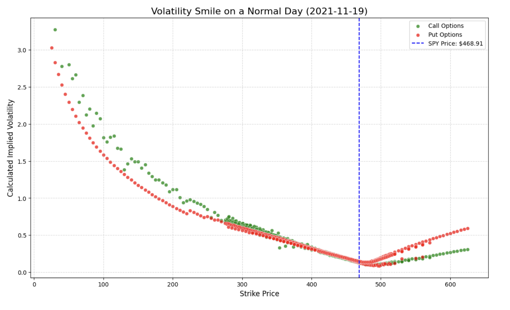
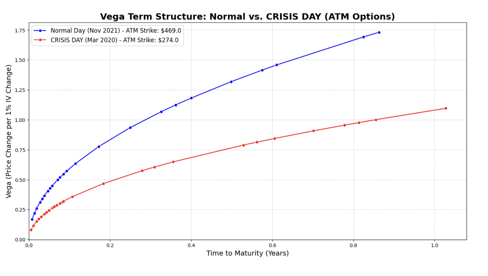
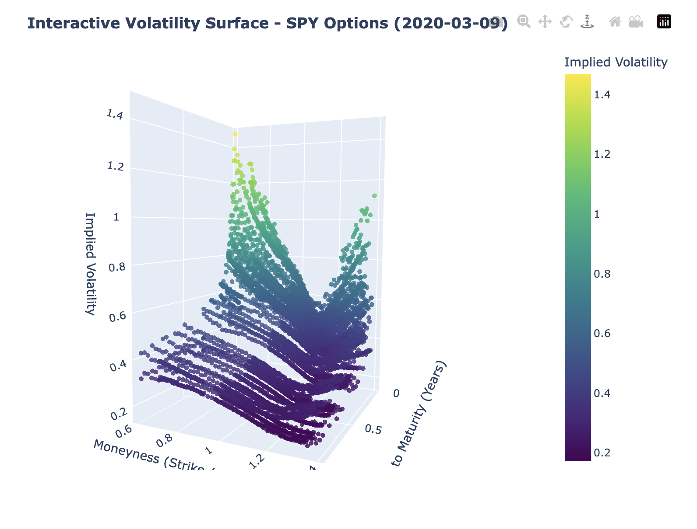

# S&P 500 Volatility Surface Analysis: A Vectorized Approach

## Project Overview

This project investigates the breakdown of the Black-Scholes constant volatility assumption through a comparative analysis of market regimes. Instead of relying on standard "black-box" libraries for option pricing, I engineered a custom, vectorized Implied Volatility solver from scratch using the Newton-Raphson method.

The core objective was to process a large-scale dataset (over 6.5 million contracts) to empirically demonstrate the "Volatility Smile" phenomenon and analyze how risk metrics (specifically Vega) behave during extreme market stress (the COVID-19 crash of March 2020) compared to a normal market environment (November 2021).

## Technical Implementation

### Custom Pricing Engine vs. Standard Libraries
While libraries like `py_vollib` are standard, they are often not optimized for processing millions of rows simultaneously. To overcome this, I implemented a fully vectorized pricing engine using NumPy.

* **Algorithm:** Newton-Raphson method for root finding on the Black-Scholes equation.
* **Optimization:** Replaced row-wise iteration with vector operations, achieving a significant performance improvement in calculation time.
* **Stability:** Implemented dynamic gradient clipping and bound handling to prevent numerical divergence (NaNs) for deep In-The-Money (ITM) and Out-Of-The-Money (OTM) options.

### Data Engineering
The raw dataset consisted of high-frequency options data (~2GB). Processing this required strict type enforcement and memory optimization techniques. The pipeline includes:
* Dynamic integration of the Risk-Free Rate via the **FRED API** (matching each quote date with the specific 3-Month T-Bill rate).
* Filtration of arbitrage violations and illiquid contracts to ensure statistical robustness.

## Key Insights

### 1. The Volatility Smile
The analysis confirms the existence of a pronounced volatility skew. As demonstrated in the generated plots, OTM Puts trade at significantly higher implied volatilities than ATM Calls, reflecting the market's structural demand for downside protection.

### 2. The "Vega Paradox" During Crisis
Comparing the Vega term structure between November 2021 (Normal) and March 2020 (Crisis) revealed a counter-intuitive finding. Despite the massive spike in Implied Volatility during the crash, the absolute Vega values were lower than in the normal regime.

**Interpretation:**
Vega scales with the underlying asset price ($S$).
* **Normal Regime:** SPY $\approx$ $469
* **Crisis Regime:** SPY $\approx$ $274

The ~40% drop in the spot price exerted a stronger downward pressure on the raw Vega calculation than the upward pressure from increased volatility. This highlights a critical distinction between percentage-based risk (IV) and dollar-based risk exposure.

### 3. Interactive Volatility Surface (3D Visualization)
To visualize the complete volatility structure across all strikes and maturities simultaneously, I generated a 3D surface plot. This illustrates the "Smirk" effect across the term structure.

## Repository Structure

* `Volatility_Smile_Analysis.ipynb`: The main Jupyter Notebook containing the pricing engine, data processing pipeline, and visualization code.
* `images/`: Generated plots demonstrating the volatility surface and risk comparisons.
* `requirements.txt`: Python dependencies required to reproduce the analysis.

## Dataset & Reproducibility

Due to GitHub's file size limits, the raw dataset is hosted on Kaggle. The notebook is configured to fetch data directly or can be run via the Kaggle platform.

[View the Dataset and Notebook on Kaggle](https://www.kaggle.com/code/smailegeouz/analysis-of-the-volatility-smile-in-spy-options)

## License

MIT License
